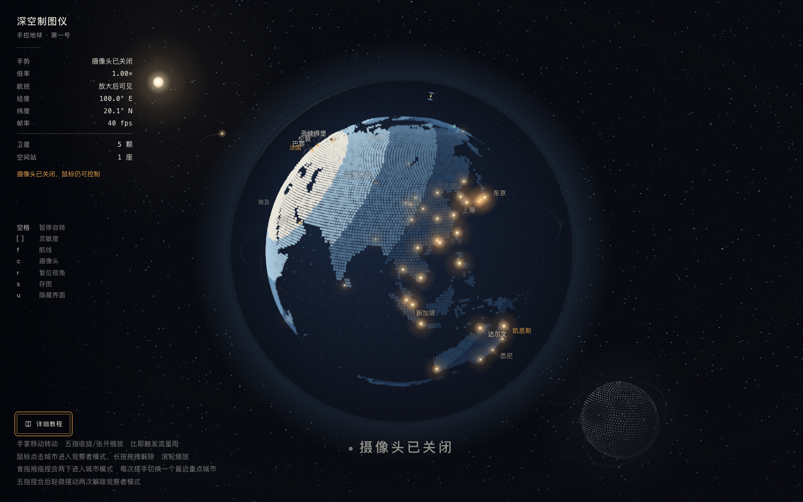

# 深空制图仪 · Gesture-controlled Globe

用手掌拨动地球，在粒子星空中观察城市、航线与月球。基于 p5.js 和 MediaPipe Hands 的浏览器交互作品，也支持鼠标和键盘操作。

A browser-based interactive globe with hand tracking, a particle starfield, city lights and animated routes. Built with p5.js and MediaPipe Hands; mouse and keyboard controls are also available.



## 快速开始

无需构建，也不需要 npm 安装。下载完整仓库后，用本地 HTTP 服务器打开，避免直接双击 `index.html`。

**VS Code：** 安装 Live Server 扩展，右键 `index.html` → **Open with Live Server**。

**或使用 Python 3：**

```sh
git clone https://github.com/wenkesun-creator/globe.git
cd globe
python3 -m http.server 8000 --bind 127.0.0.1
```

打开 <http://127.0.0.1:8000>。要使用手势，请允许摄像头访问；拒绝授权或没有摄像头时，可以使用鼠标。停止服务器按 `Ctrl+C`。

使用支持摄像头和 WebAssembly 的现代桌面浏览器。远程部署时应使用 HTTPS；普通远程 HTTP 地址可能无法访问摄像头。移动端尚未完成手势兼容性测试。

## 操作

| 操作 | 效果 |
| --- | --- |
| 手掌移动 | 转动地球 |
| 五指收拢 / 张开 | 缩小 / 放大 |
| 比耶并保持片刻 | 触发流星雨 |
| 拇指与食指连续捏合两次 | 进入城市观察者模式 |
| 观察者模式下摆手 | 切换重点城市 |
| 五指聚拢后轻摆两次 | 退出观察者模式 |
| 鼠标拖拽 / 滚轮 | 转动 / 缩放 |
| 点击城市 | 聚焦城市；长按拖拽可退出 |
| 空格 | 暂停 / 恢复自转 |
| `c` / `f` | 切换摄像头 / 航线 |
| `r` / `s` | 复位视角 / 保存 PNG |
| `u` | 隐藏 / 显示界面 |

页面左下角有带图示的“详细教程”。更多操作、参数与排错见 [操作与参数指南](docs/GUIDE.md)。

## 摄像头与数据

手部识别在浏览器本地执行。项目自有代码没有上传摄像头画面或手势数据的接口；p5.js、MediaPipe 的脚本、模型和 WASM 随仓库提供。完整下载后可通过本地服务器离线运行。网页托管服务可能保留普通访问日志。

航线、卫星及天体运动用于艺术化展示，不是实时航班、卫星追踪或科学观测数据。

## 项目结构

- `index.html`、`css/style.css`：界面与操作教程。
- `sketch.js`：绘制、手势识别、鼠标和键盘交互。
- `assets/earth.jpg`：用于识别海陆的地球贴图。
- `assets/mediapipe/`、`js/p5.min.js`：随项目分发的第三方依赖。
- `docs/`：运行截图和详细指南。

## 反馈与贡献

欢迎提交 [Issue](https://github.com/wenkesun-creator/globe/issues) 或 Pull Request。反馈问题时请附浏览器版本、操作系统、复现步骤和控制台报错；请勿上传含私人画面的摄像头录像。

## 许可

原创项目代码采用 [MIT License](LICENSE)，允许在保留版权和许可声明的条件下使用、修改和商用。第三方库和素材不自动适用 MIT，请分别查看 [第三方声明](THIRD_PARTY_NOTICES.md)。
